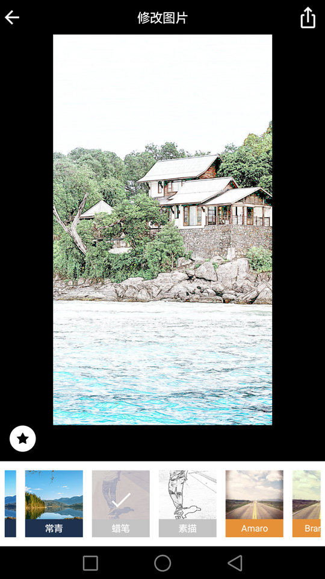

# FilterCamera 🎬

> 实时滤镜相机 - 包含美颜等72种实时滤镜，支持拍照、录像功能

## 项目概览

FilterCamera 是一款 Android 实时滤镜相机应用，提供：
- ✅ 72种实时滤镜效果（风格、特效、Instagram、水印）
- ✅ 22种GPU特效（扭曲、像素化、艺术、模糊等）
- ✅ 20种Instagram经典滤镜（独立分类）
- ✅ 10种水印相机（时间戳、地理位置、天气、设备信息等）
- ✅ 10级美颜强度调节（GPU加速）
- ✅ 高清拍照和视频录制
- ✅ 前后摄像头切换
- ✅ **图片编辑器**（裁剪/旋转/翻转/调整/滤镜后期）
- ✅ **相册管理**（网格浏览/搜索/多选删除）
- ✅ 定时拍照（3秒/5秒/10秒）
- ✅ Pro模式（ISO/快门/白平衡/对焦手动控制）
- ✅ Jetpack Compose 现代化UI
- ✅ Clean Architecture 清晰架构

**不包含**：云端同步、社交分享

## 架构设计

### 技术栈
| 组件 | 技术选型 | 版本 |
|-----|---------|------|
| 语言 | Kotlin | 2.1.0 |
| 最低SDK | Android 7 (API 24) | - |
| 目标SDK | Android 16 (API 36) | - |
| UI框架 | Jetpack Compose | BOM 2024.12.01 |
| 相机 | CameraX | 1.4.1 |
| 依赖注入 | Hilt | 2.54 |
| 异步 | Kotlin Coroutines/Flow | 1.10.1 |
| Native | CMake + NDK | C++17 |
| 构建 | AGP + Kotlin DSL | 8.13.1 |

### 架构模式：Clean Architecture

```
app/
├── domain/           # 领域层 - 业务核心
│   ├── model/        # 实体：FilterType, BeautyLevel, CameraState, EditState
│   ├── repository/   # 仓库接口：ICameraRepository, IFilterRepository, IMediaRepository
│   └── usecase/      # 用例：TakePhotoUseCase, ApplyFilterUseCase
│
├── data/             # 数据层 - 数据来源
│   ├── repository/   # 仓库实现：CameraRepositoryImpl, MediaRepositoryImpl
│   └── processor/    # 处理器：BeautyProcessor, FaceDetectionProcessor
│
├── presentation/     # 表现层 - UI
│   ├── camera/       # 相机页面：CameraScreen, CameraViewModel
│   ├── gallery/      # 相册页面：GalleryScreen, GalleryViewModel（含搜索功能）
│   ├── edit/         # 编辑页面：EditScreen, EditViewModel（裁剪/调整/滤镜）
│   ├── settings/     # 设置页面：SettingsScreen, SettingsViewModel
│   ├── navigation/   # 导航：NavGraph, Screen
│   └── common/theme/ # 主题：Color, Type, Theme
│
└── di/               # 依赖注入：AppModule, RepositoryModule
```

### 设计决策
1. **CameraX替代Camera API** - 简化生命周期管理，内置预览/拍照/录像支持
2. **Hilt依赖注入** - 解耦组件，便于测试和维护
3. **Flow状态管理** - 响应式UI更新，单向数据流
4. **MediaStore存储** - 适配Scoped Storage，无需MANAGE_EXTERNAL_STORAGE权限

## 工程结构

```
FilterCamera/
├── app/                          # 主应用模块
│   └── src/main/
│       ├── kotlin/com/qihao/filtercamera/
│       │   ├── FilterCameraApp.kt    # Application入口
│       │   ├── MainActivity.kt       # 主Activity
│       │   ├── domain/               # 领域层
│       │   ├── data/                 # 数据层
│       │   ├── presentation/         # 表现层
│       │   └── di/                   # 依赖注入
│       └── res/                      # 资源文件
│
├── core/
│   ├── filter/                   # 滤镜核心模块
│   │   └── src/main/cpp/         # Native美颜算法
│   │       ├── MagicJni.cpp      # JNI接口
│   │       ├── beautify/         # 美颜算法
│   │       └── bitmap/           # 位图操作
│   └── common/                   # 公共工具模块
│
├── gradle/
│   └── libs.versions.toml        # 版本目录
│
├── build.gradle.kts              # 根构建脚本
├── settings.gradle.kts           # 设置脚本
└── gradle.properties             # Gradle属性
```

## 运行环境

### 系统要求
- **操作系统**：macOS / Windows / Linux
- **JDK**：21+
- **Android Studio**：Ladybug 2024.2.1+
- **Gradle**：8.13

### 设备要求
- **最低版本**：Android 7.0 (API 24)
- **目标版本**：Android 16 (API 36)
- **架构支持**：arm64-v8a, armeabi-v7a, x86_64（模拟器）
- **硬件**：支持相机设备

## 从零搭建指南

### 1. 环境准备
```bash
# 安装JDK 21
brew install openjdk@21

# 设置JAVA_HOME
export JAVA_HOME=$(/usr/libexec/java_home -v 21)

# 验证版本
java -version
```

### 2. 克隆项目
```bash
git clone https://github.com/Pangu-Immortal/FilterCamera.git
cd FilterCamera
```

### 3. 安装NDK（首次构建自动下载）
```bash
# 或手动指定NDK路径
# 在local.properties中添加：
# ndk.dir=/path/to/android-ndk
```

### 4. 构建项目
```bash
# Debug构建
./gradlew assembleDebug

# Release构建
./gradlew assembleRelease
```

### 5. 安装到设备
```bash
./gradlew installDebug
```

## 快速启动

### 环境检查
```bash
# 检查Java版本
java -version
# 期望输出：openjdk version "21.x.x"

# 检查Gradle版本
./gradlew --version
# 期望输出：Gradle 8.13
```

### 构建命令
```bash
# 清理并构建
./gradlew clean assembleDebug

# 仅编译（不打包）
./gradlew compileDebugKotlin

# 运行Lint检查
./gradlew lint
```

### 常见问题

**Q: 构建报错 "SDK location not found"**
```bash
# 创建local.properties，添加SDK路径
echo "sdk.dir=/Users/$(whoami)/Library/Android/sdk" > local.properties
```

**Q: NDK编译失败**
```bash
# 确保安装了CMake和NDK
# Android Studio -> SDK Manager -> SDK Tools -> 勾选CMake和NDK
```

**Q: 内存不足OOM**
```bash
# 增加Gradle堆内存（已配置4GB）
# 如需更多，编辑gradle.properties：
# org.gradle.jvmargs=-Xmx8192m
```

## 核心流程

### 1. 相机预览流程
```
用户打开App
  → MainActivity.onCreate()
  → CameraScreen Composable加载
  → 检查Camera权限
  → CameraRepositoryImpl.bindCamera()
  → CameraX Preview绑定到PreviewView
  → 实时预览显示
```

### 2. 拍照流程
```
用户点击拍照按钮
  → CameraViewModel.takePhoto()
  → TakePhotoUseCase.invoke()
  → CameraRepositoryImpl.takePhoto() [CameraX ImageCapture]
  → MediaRepositoryImpl.savePhoto() [MediaStore API]
  → 返回Uri，显示Toast
```

### 3. 滤镜切换流程
```
用户选择滤镜
  → CameraViewModel.selectFilter()
  → ApplyFilterUseCase.invoke()
  → FilterRepositoryImpl.setCurrentFilter()
  → CameraRepositoryImpl.applyFilter()
  → OpenGL渲染滤镜效果
  → 预览实时更新
```

### 4. 图片编辑流程
```
用户从相册进入编辑
  → GalleryScreen点击编辑按钮
  → 导航到EditScreen(imageUri)
  → EditViewModel.loadImage()
  → MediaRepositoryImpl.loadBitmap()（含EXIF方向处理）
  → GPUImage应用调整参数（亮度/对比度/饱和度/锐度/色温/暗角/高光/阴影）
  → Matrix应用变换（旋转/翻转）
  → FilterRepositoryImpl.applyFilter()（后期滤镜）
  → 预览实时更新
  → 保存：MediaRepositoryImpl.savePhoto()
```

### 5. 相册搜索流程
```
用户点击搜索图标
  → GalleryViewModel.setSearchActive(true)
  → 显示SearchTopBar
  → 用户输入关键词
  → GalleryViewModel.search(query)
  → 过滤mediaFiles（文件名包含关键词）
  → 显示filteredMediaFiles
```

## 技术债与风险

### Phase 10 功能扩展（2026-01-19 完成）
| 新功能 | 说明 |
|-------|------|
| 图片编辑器 | EditScreen + EditViewModel，支持裁剪/旋转/翻转/8种调整参数/滤镜后期 |
| 相册搜索 | GalleryScreen 文件名搜索功能，实时过滤 |
| 定时拍照 | 3秒/5秒/10秒倒计时，切换相机/模式自动取消 |
| Pro模式 | ISO/快门/白平衡/对焦手动控制 |
| 滤镜强度 | FilterIntensitySlider 0-100%强度调节 |

### Phase 9 技术债修复（2026-01-19 完成）
| 修复项 | 说明 |
|-------|------|
| JNI异常处理 | SafeMagicJni 安全封装，美颜失败优雅降级 |
| 帧缓冲优化 | FrameRingBuffer + 跳帧策略，消除ANR风险 |
| ViewModel拆分 | ProModeState + FilterSelectorState 状态类 |
| 滤镜注册表 | FilterRegistry 替代大型switch语句 |
| x86_64支持 | 模拟器可运行Native代码 |

### 已知限制
| 项目 | 说明 | 建议 |
|-----|------|-----|
| 滤镜预览缩略图 | 尚未实现OpenGL离屏渲染 | 后续版本完善 |
| 相机绑定 | CameraScreen中需要手动绑定 | 封装到CompositionLocal |
| ProGuard规则 | 部分模块缺少consumer-rules.pro | 创建空文件 |

### 不建议修改的区域
- `core/filter/src/main/cpp/` - Native美颜算法，修改需C++经验
- `libs.versions.toml` - 版本依赖已验证，升级需全面测试

## 滤镜效果列表（72种）

### 风格滤镜（19种）- GPU LUT
| 滤镜名 | 效果描述 |
|-------|---------|
| 童话、日出、日落、白猫、黑猫 | 色调风格化 |
| 美白、健康、甜蜜、浪漫、樱花 | 人像美化 |
| 温暖、复古、怀旧、平静、拿铁 | 氛围渲染 |
| 柔和、清凉、翡翠、常青 | 自然色调 |

### 特效滤镜（22种）- GPU Fragment Shader
| 分类 | 滤镜名 | 技术原理 |
|-----|-------|---------|
| **原有** | 蜡笔、素描 | 边缘检测+颜色量化 |
| **扭曲类** | 漩涡、鱼眼、捏缩、拉伸、玻璃球 | 极坐标/径向UV变形 |
| **像素化** | 像素化、半色调、交叉线、波点、马赛克 | 采样/网格映射 |
| **艺术类** | 油画、色调分离、浮雕、卡通、平滑卡通 | Kuwahara滤波/Sobel边缘 |
| **模糊类** | 移轴、动态模糊、缩放模糊、暗角、边缘检测 | 高斯/方向模糊 |

### Instagram风格（20种）- GPU LUT（独立分类）
| 滤镜 | 风格描述 |
|-----|---------|
| Amaro、Brannan、Brooklyn | 曝光柔化、金属灰、淡褪色 |
| Earlybird、Freud、Hefe | 复古黄棕、冷蓝紫、高对比 |
| Hudson、Inkwell、Kevin | 冷阴影、经典黑白、黄绿调 |
| Lomo、1977、Nashville | 胶片风格、复古、温暖粉 |
| Pixar、Rise、Sierra | 动画风、柔和暖、柔和对比 |
| Sutro、Toaster、Valencia | 紫褐色、老照片、褪色暖 |
| Walden、X-Pro II | 黄色增强、高对比暗角 |

### 水印相机（10种）- Canvas绘制
| 水印类型 | 功能描述 | 参考设计 |
|---------|---------|---------|
| 时间戳 | 日期+时间 | 通用相机 |
| 地理位置 | GPS位置+详细地址 | 小米/华为 |
| 天气 | 当前天气信息 | vivo/OPPO |
| 地图 | 地图截图+位置标记 | GPS Map Camera |
| 经纬度 | GPS坐标显示 | 专业相机 |
| 海拔 | 海拔高度信息 | 户外相机 |
| 设备信息 | 设备型号+镜头参数 | 徕卡水印风格 |
| 指南针 | 方向指示 | 户外相机 |
| 自定义 | 用户自定义文字 | 通用功能 |
| 日期 | 仅日期（不含时间） | 简洁模式 |

### 图像调整（8种）- GPU Shader参数
亮度、对比度、饱和度、锐度、色温、暗角、高光、阴影

## 样张展示

| 原图 | 童话 | 复古 |
|-----|------|-----|
|  |  |  |

## 开源引用

| 库 | 用途 | 链接 |
|---|------|------|
| CameraX | 相机框架 | https://developer.android.com/training/camerax |
| Hilt | 依赖注入 | https://dagger.dev/hilt/ |
| Jetpack Compose | UI框架 | https://developer.android.com/jetpack/compose |
| Accompanist | 权限处理 | https://google.github.io/accompanist/ |
| Coil | 图片加载（相册） | https://coil-kt.github.io/coil/ |
| android-gpuimage | 滤镜渲染+图片编辑 | https://github.com/cats-oss/android-gpuimage |
| GPUImage | 滤镜Shader参考 | https://github.com/BradLarson/GPUImage |
| GPUPixel | 滤镜算法参考 | https://gpupixel.pixpark.net/ |

## License

```
MIT License

Copyright (c) 2024-2026 qihao

Permission is hereby granted, free of charge, to any person obtaining a copy
of this software and associated documentation files (the "Software"), to deal
in the Software without restriction, including without limitation the rights
to use, copy, modify, merge, publish, distribute, sublicense, and/or sell
copies of the Software, and to permit persons to whom the Software is
furnished to do so, subject to the following conditions:

The above copyright notice and this permission notice shall be included in all
copies or substantial portions of the Software.
```

---

⭐ **如果这个项目对你有帮助，请点击Star支持！**
