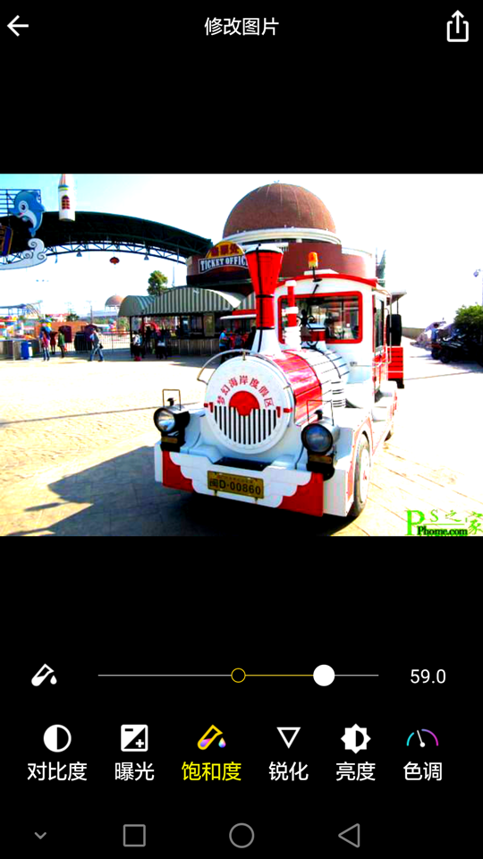
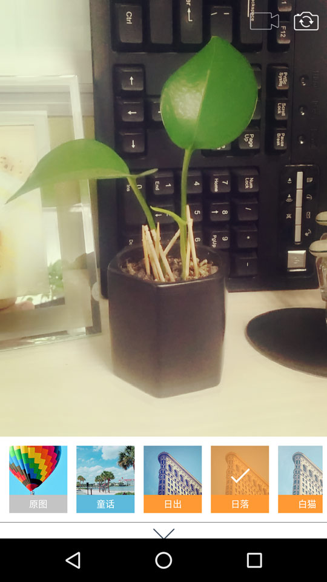
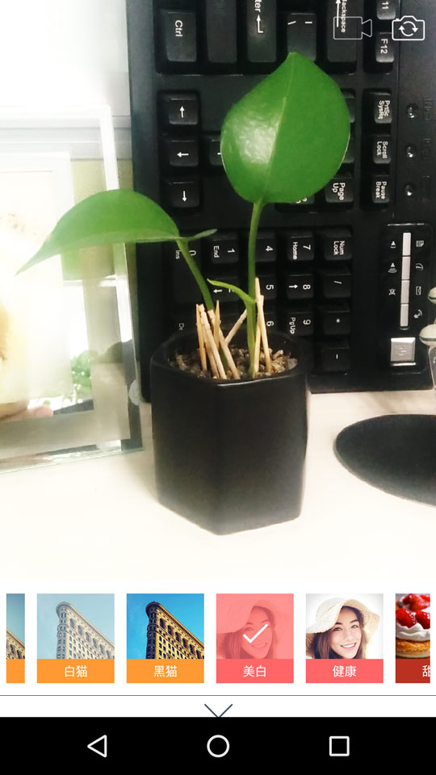
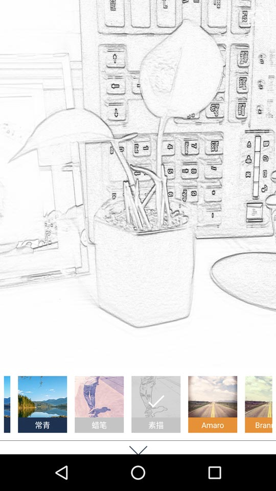

# FilterCamera
# Click "Star" if this is helpful for you!
Idea from:android-gpuimage

Real-time Filter Camera&VideoRecorder And ImageEditor With Face Beauty For Android

包含美颜等40余种实时滤镜相机，可拍照、录像、图片修改

实时滤镜相机、美颜相机、相机水印
# Click "Star" if this is helpful for you!

[原地址点这里](https://github.com/wuhaoyu1990/MagicCamera)

种种迹象表明，作者已弃坑，由于需要做相关的开发，找到这个项目，时间太久远，项目已经不能运行在高版本的AS下了，将代码重新整理，方便大家。

Demo未做改动，magicfilter采用了cmake方式重新编译。

**再次感谢作者，谢谢！**

### 样张：

